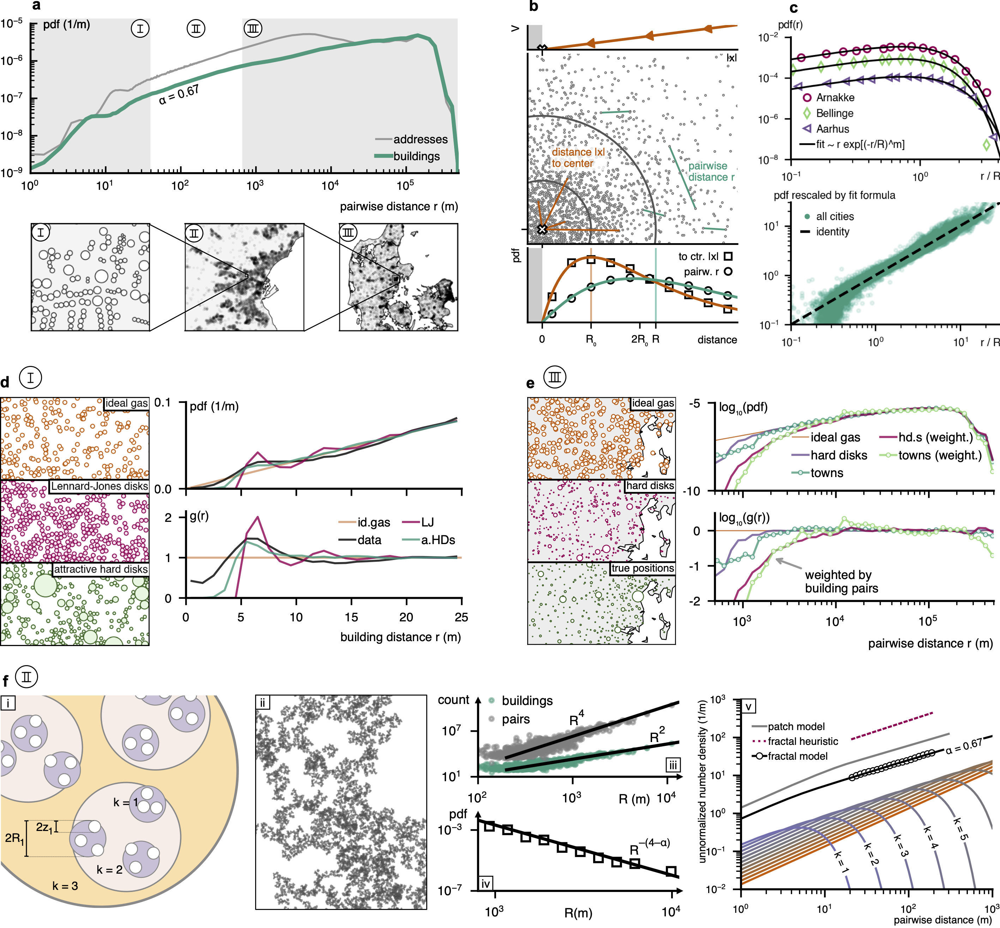
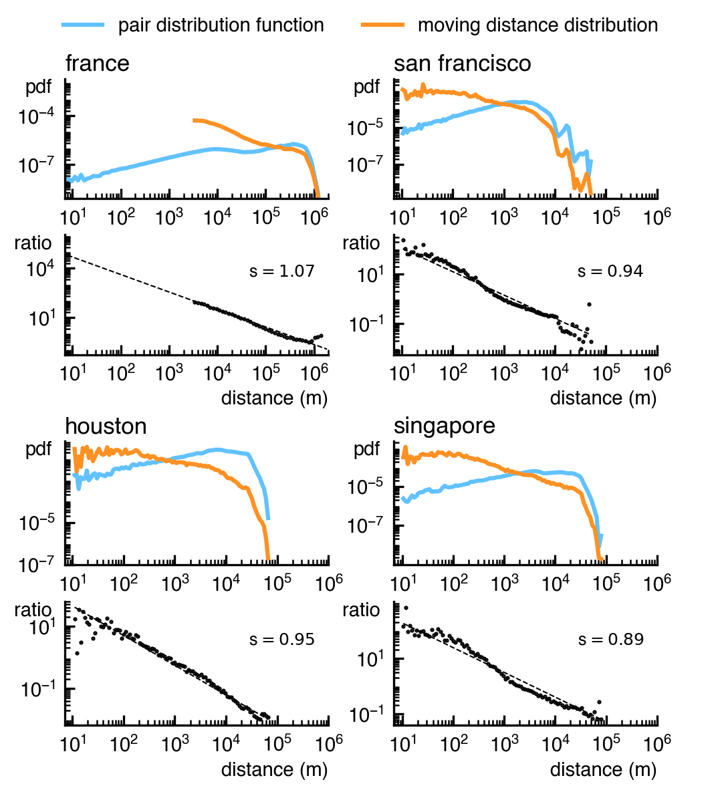

# Decomposing Geographical and Universal Aspects of Human Mobility: Code, Data, and Additional Figures

[](https://zenodo.org/badge/latestdoi/793592835)
[](https://opensource.org/licenses/MIT)
[](https://www.python.org/dev/peps/pep-0008/)

- [Abstract](#abstract)
- [Zenodo Repo](#zenodo-repo)
- [Installation](#installation)
- [Data](#data-sources)
- [Usage](#usage)
- [Model of locations](#model-of-locations)
- [Issues](https://github.com/lcb0b/role-of-geo/issues)


# Abstract

Driven by access to large volumes of detailed movement data, the study of human mobility has grown rapidly over the past decade. This body of work has argued that human mobility is scale-free, has proposed models to generate scale-free moving distance distribution, and explained how the scale-free distribution arises from aggregating displacements across scales. However, the field of human mobility has not explicitly addressed how mobility is structured by geographical constraints—such as the outlines of landmasses, lakes, rivers, the placement of buildings, roadways, and cities. Using unique datasets capturing millions of movements between precise locations, this paper shows how separating the effect of geography from mobility choices reveals a universal power law spanning five orders of magnitude (from 10 m to 1,000,000 m). We incorporate geography through the 'pair distribution function,' a fundamental quantity from condensed matter physics that encapsulates the structure of locations on which mobility occurs. This distribution captures the constraints that geography places on human mobility across different length scales. Our description conclusively addresses debates between distance-based and opportunity-based perspectives on human mobility. By demonstrating how the spatial distribution of human settlements shapes human mobility, we provide a novel perspective that bridges the gap between these previously opposing ideas.


## Zenodo Repo

[https://zenodo.org/records/11990046](https://zenodo.org/records/11990046)

# Installation

```bash
git clone https://github.com/LCB0B/role-of-geo.git
cd role-of-geo
pip install -r requirements.txt
```
python version:
```bash
 Python 3.10
```

# Data Sources:
Denmark:
- Residential Mobility : Danmarks Statistik (DST)
- Location coordinates : DST, partially publicly available at https://dawadocs.dataforsyningen.dk/dok/api/adgangsadresse#databeskrivelse

France :
- Residential Mobility :
- Location coordiantes :

Day-to-day Mobility:
- Foursquare (not publicly available)


# Usage

## Reproducing figures from the manuscript
python src/figure-{i}.py

Figure1 
<figure>
    
</figure>

Figure2
<figure>
    
</figure>

Figure3
<figure>
    
</figure>

Figure4
<figure>
    
</figure>

# Model of locations
Simulate Lennard-Jones spheres and similar systems in the context of location of buildings.
```
git clone https://github.com/benmaier/ljhouses
pip install ./ljhouses

```
# Contributing

Contributions are what make the open-source community such an amazing place to learn, inspire, and create. Any contributions you make are **greatly appreciated**.

1. Fork the Project
2. Create your Feature Branch (`git checkout -b feature/AmazingFeature`)
3. Commit your Changes (`git commit -m 'Add some AmazingFeature'`)
4. Push to the Branch (`git push origin feature/AmazingFeature`)
5. Open a Pull Request

# Contact

louis boucherie - louishboucherie@gmail.com

Project Link: [https://github.com/LCB0B/role-of-geo](https://github.com/LCB0B/role-of-geo)
